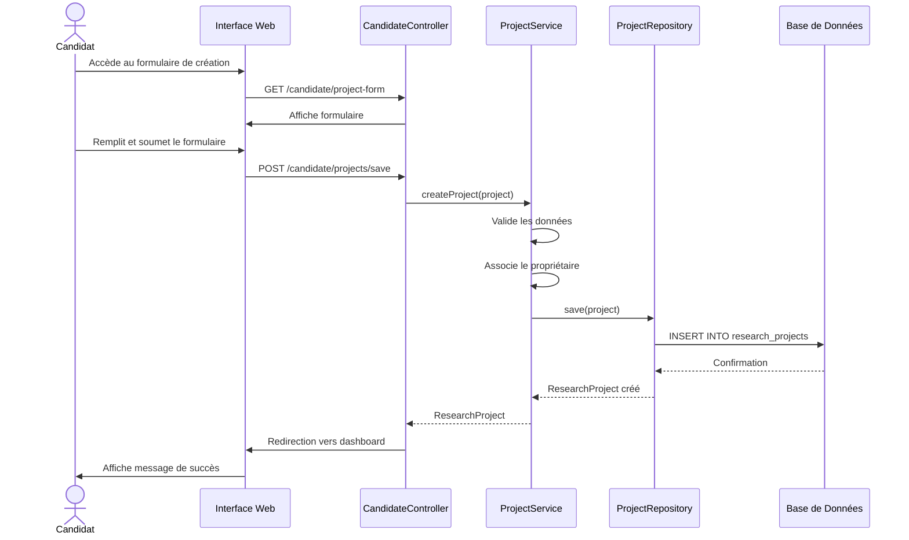
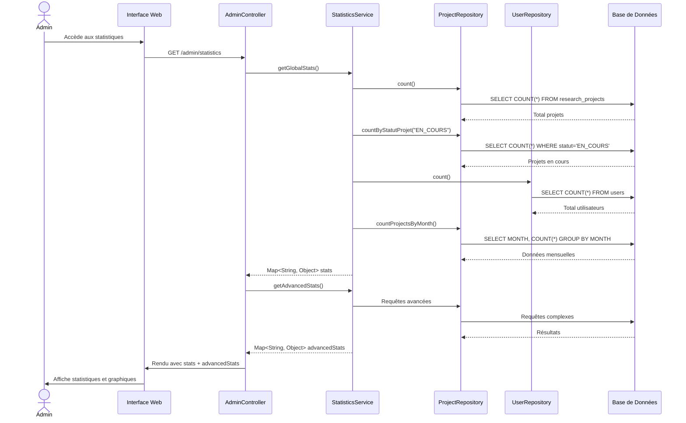
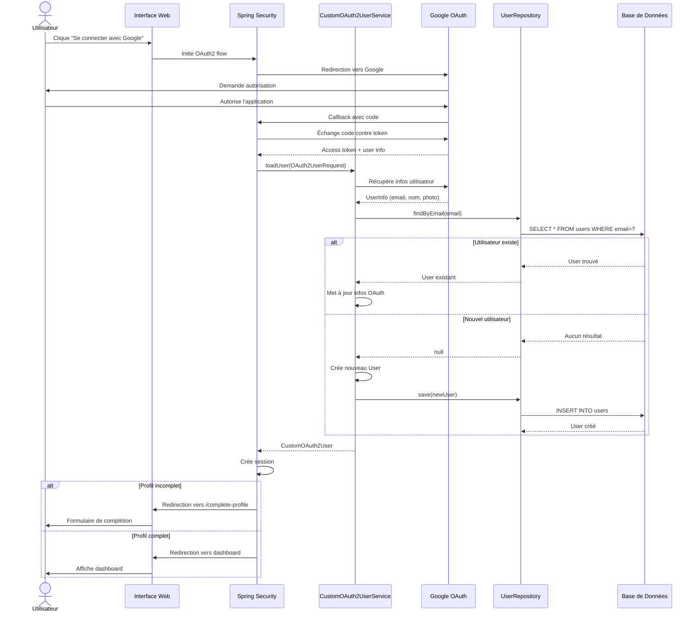
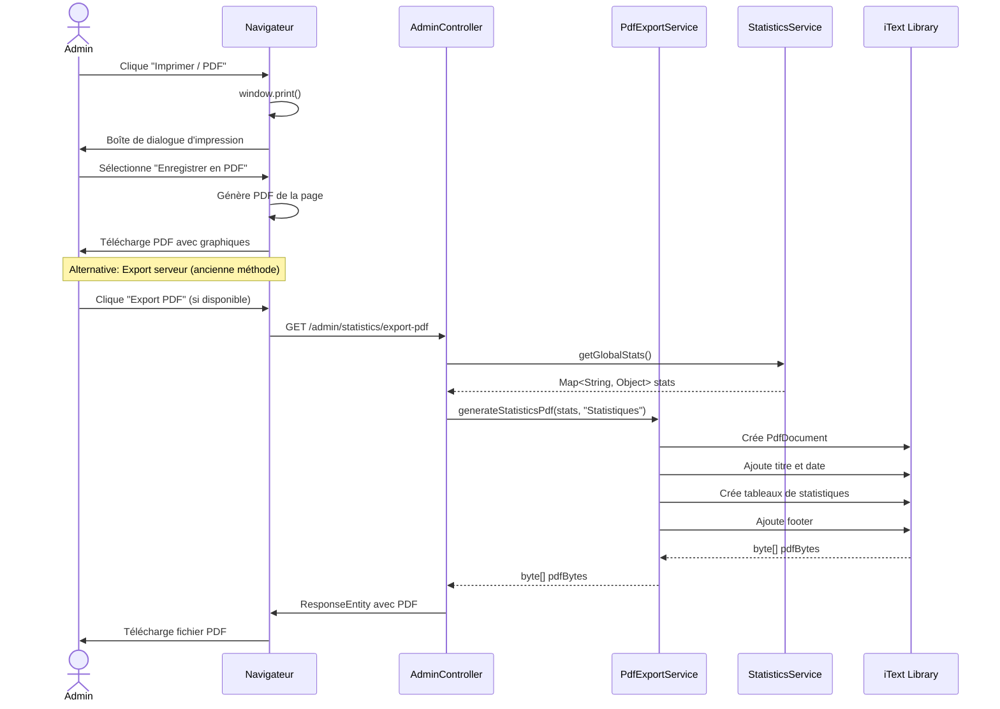
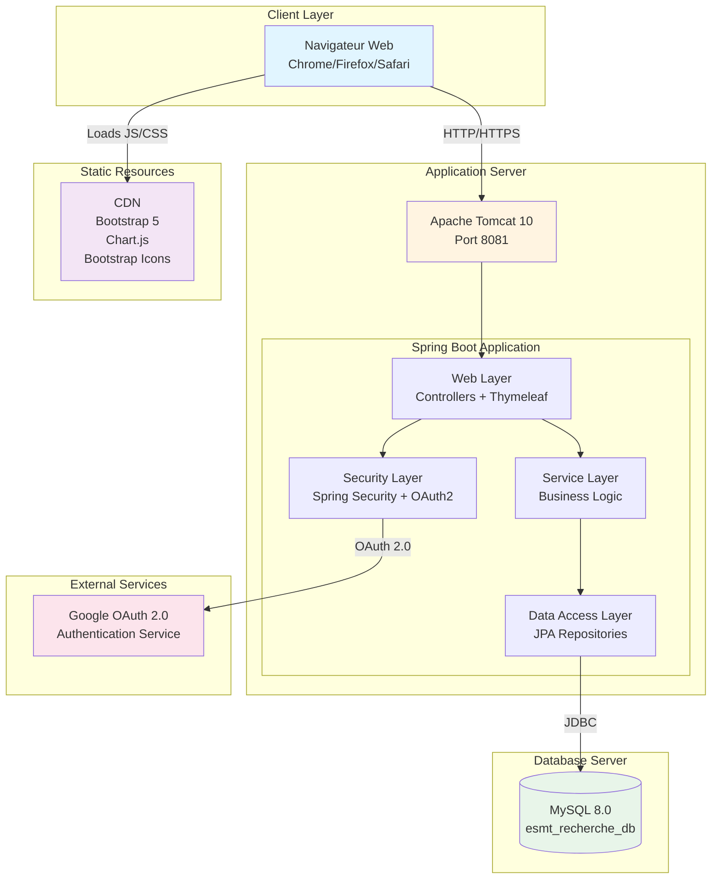
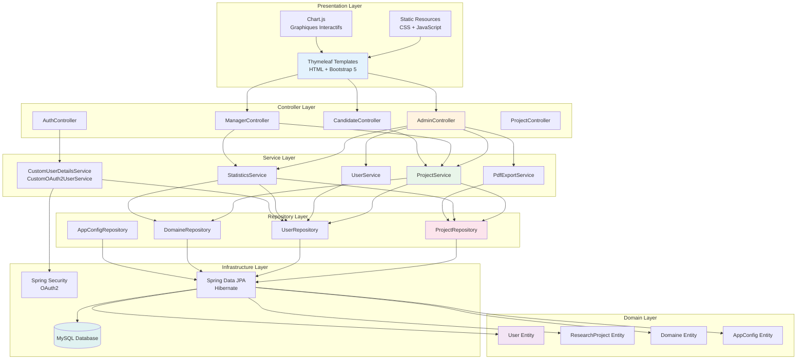
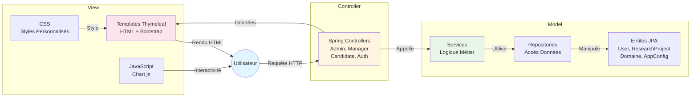

# 📐 Diagrammes UML - Plateforme de Cartographie des Projets de Recherche

Documentation complète des diagrammes UML du système.

---

## 📊 Table des Matières

1. [Diagramme de Classes](#1-diagramme-de-classes)
2. [Diagramme de Cas d'Utilisation](#2-diagramme-de-cas-dutilisation)
3. [Diagrammes de Séquence](#3-diagrammes-de-séquence)
4. [Diagramme de Déploiement](#4-diagramme-de-déploiement)
5. [Diagramme d'Architecture](#5-diagramme-darchitecture)

---

## 1. Diagramme de Classes

### 1.1 Modèle de Domaine Complet

```mermaid
classDiagram
    %% ========== ENTITÉS PRINCIPALES ==========
    
    class User {
        -String id
        -String email
        -String password
        -String nom
        -String prenom
        -String telephone
        -String role
        -String institution
        -String departement
        -String specialite
        -String niveauEtude
        -String bio
        -String oauthId
        -String provider
        -String picture
        -Boolean profileCompleted
        -LocalDateTime createdAt
        -LocalDateTime updatedAt
        -Boolean active
        -Set~ResearchProject~ projects
        +getFullName() String
    }
    
    class ResearchProject {
        -Long id
        -String titreProjet
        -String description
        -String listeParticipants
        -String autresParticipants
        -String domaineRecherche
        -String statutProjet
        -Integer niveauAvancement
        -User proprietaire
        -String responsableProjet
        -String institution
        -Double budgetEstime
        -LocalDate dateDebut
        -LocalDate dateFin
        -LocalDateTime dateCreation
        -LocalDateTime dateModification
        -Set~User~ members
        +getStatutLisible() String
        +isModifiable() boolean
        +isEnRetard() boolean
        +getResumeCourt() String
        +getStatutCouleur() String
    }
    
    class Domaine {
        -Long id
        -String nom
        -String description
        -long nbProjets
    }
    
    class AppConfig {
        -Long id
        -String configKey
        -String configValue
        -String description
    }
    
    class ProjectStatus {
        <<enumeration>>
        EN_COURS
        SUSPENDU
        TERMINE
    }
    
    %% ========== SERVICES ==========
    
    class ProjectService {
        -ProjectRepository projectRepository
        -UserRepository userRepository
        -DomaineRepository domaineRepository
        +getAllProjects() List~ResearchProject~
        +getProjectById(Long id) ResearchProject
        +createProject(ResearchProject project) ResearchProject
        +updateProject(ResearchProject project) ResearchProject
        +deleteProject(Long id) void
        +getCurrentUser() User
        +getProjectsByUser(User user) List~ResearchProject~
        +addMemberToProject(Long projectId, String userId) void
        +removeMemberFromProject(Long projectId, String userId) void
    }
    
    class UserService {
        -UserRepository userRepository
        -PasswordEncoder passwordEncoder
        +getAllUsers() List~User~
        +getUserById(String id) User
        +createUser(User user) User
        +updateUser(User user) User
        +deleteUser(String id) void
        +findByEmail(String email) User
        +changeUserRole(String userId, String newRole) void
    }
    
    class StatisticsService {
        -ProjectRepository projectRepository
        -UserRepository userRepository
        -DomaineRepository domaineRepository
        +getGlobalStats() Map~String, Object~
        +getAdvancedStats() Map~String, Object~
        +getProjectsByDomain() Map~String, Long~
        +getProjectsByStatus() Map~String, Long~
        +getBudgetByDomain() Map~String, Double~
        +getMonthlyProjectGrowth() List~Object[]~
        +getTopParticipants() List~Object[]~
    }
    
    class PdfExportService {
        -ProjectRepository projectRepository
        +exportProjectToPdf(Long projectId) byte[]
        +generateStatisticsPdf(Map stats, String title) byte[]
        -addTableRow(Table table, String label, String value) void
        -addTableHeader(Table table, String headerText) void
        -createCell(String text) Cell
    }
    
    %% ========== REPOSITORIES ==========
    
    class ProjectRepository {
        <<interface>>
        +findAll() List~ResearchProject~
        +findById(Long id) Optional~ResearchProject~
        +save(ResearchProject project) ResearchProject
        +deleteById(Long id) void
        +findByProprietaire(User user) List~ResearchProject~
        +countByStatutProjet(String statut) long
        +countOverdueProjects() long
        +countProjectsByMonth() List~Object[]~
        +findProjectsByDomain(String domain) List~ResearchProject~
    }
    
    class UserRepository {
        <<interface>>
        +findAll() List~User~
        +findById(String id) Optional~User~
        +save(User user) User
        +deleteById(String id) void
        +findByEmail(String email) Optional~User~
        +findByOauthId(String oauthId) Optional~User~
        +countByRole(String role) long
        +countUsersByInstitution() List~Object[]~
    }
    
    class DomaineRepository {
        <<interface>>
        +findAll() List~Domaine~
        +findById(Long id) Optional~Domaine~
        +save(Domaine domaine) Domaine
        +deleteById(Long id) void
        +findByNom(String nom) Optional~Domaine~
    }
    
    %% ========== CONTRÔLEURS ==========
    
    class AdminController {
        -ProjectService projectService
        -UserService userService
        -StatisticsService statisticsService
        -PdfExportService pdfExportService
        +dashboard(Model model) String
        +users(Model model) String
        +projects(Model model) String
        +charts(Model model) String
        +statistics(Model model) String
        +reports(Model model) String
        +exportStatisticsPdf() ResponseEntity~byte[]~
    }
    
    class ManagerController {
        -ProjectService projectService
        -StatisticsService statisticsService
        +dashboard(Model model) String
        +projects(Model model) String
        +charts(Model model) String
        +statistics(Model model) String
    }
    
    class CandidateController {
        -ProjectService projectService
        +dashboard(Model model) String
        +myProjects(Model model) String
        +createProject(ResearchProject project) String
        +editProject(Long id, Model model) String
    }
    
    %% ========== SÉCURITÉ ==========
    
    class SecurityConfig {
        -CustomUserDetailsService userDetailsService
        -CustomOAuth2UserService oauth2UserService
        +securityFilterChain(HttpSecurity http) SecurityFilterChain
        +passwordEncoder() PasswordEncoder
    }
    
    class CustomUserDetailsService {
        -UserRepository userRepository
        +loadUserByUsername(String email) UserDetails
    }
    
    class CustomOAuth2UserService {
        -UserRepository userRepository
        +loadUser(OAuth2UserRequest request) OAuth2User
    }
    
    %% ========== RELATIONS ==========
    
    User "1" --> "*" ResearchProject : proprietaire
    User "*" <--> "*" ResearchProject : members
    ResearchProject --> ProjectStatus : statut
    ResearchProject --> Domaine : domaine
    
    ProjectService --> ProjectRepository : uses
    ProjectService --> UserRepository : uses
    ProjectService --> DomaineRepository : uses
    
    UserService --> UserRepository : uses
    
    StatisticsService --> ProjectRepository : uses
    StatisticsService --> UserRepository : uses
    StatisticsService --> DomaineRepository : uses
    
    PdfExportService --> ProjectRepository : uses
    
    AdminController --> ProjectService : uses
    AdminController --> UserService : uses
    AdminController --> StatisticsService : uses
    AdminController --> PdfExportService : uses
    
    ManagerController --> ProjectService : uses
    ManagerController --> StatisticsService : uses
    
    CandidateController --> ProjectService : uses
    
    SecurityConfig --> CustomUserDetailsService : uses
    SecurityConfig --> CustomOAuth2UserService : uses
    
    CustomUserDetailsService --> UserRepository : uses
    CustomOAuth2UserService --> UserRepository : uses
```



---

## 2. Diagramme de Cas d'Utilisation

```mermaid
graph TB
    subgraph "Système de Cartographie des Projets"
        %% Cas d'utilisation Candidat
        UC1[Créer un Projet]
        UC2[Modifier mon Projet]
        UC3[Consulter mes Projets]
        UC4[Ajouter des Participants]
        UC5[Suivre l'Avancement]
        
        %% Cas d'utilisation Gestionnaire
        UC6[Gérer tous les Projets]
        UC7[Consulter Statistiques]
        UC8[Visualiser Graphiques]
        UC9[Exporter Rapports]
        UC10[Modifier Projets]
        
        %% Cas d'utilisation Admin
        UC11[Gérer Utilisateurs]
        UC12[Gérer Domaines]
        UC13[Configurer Système]
        UC14[Consulter Rapports Détaillés]
        UC15[Exporter Données]
        UC16[Gérer Rôles]
        
        %% Cas d'utilisation Communs
        UC17[S'Authentifier]
        UC18[Compléter Profil]
        UC19[Se Déconnecter]
    end
    
    %% Acteurs
    Candidat((Candidat))
    Gestionnaire((Gestionnaire))
    Admin((Administrateur))
    OAuth[Google OAuth]
    
    %% Relations Candidat
    Candidat --> UC1
    Candidat --> UC2
    Candidat --> UC3
    Candidat --> UC4
    Candidat --> UC5
    Candidat --> UC17
    Candidat --> UC18
    Candidat --> UC19
    
    %% Relations Gestionnaire
    Gestionnaire --> UC6
    Gestionnaire --> UC7
    Gestionnaire --> UC8
    Gestionnaire --> UC9
    Gestionnaire --> UC10
    Gestionnaire --> UC17
    Gestionnaire --> UC19
    
    %% Relations Admin
    Admin --> UC11
    Admin --> UC12
    Admin --> UC13
    Admin --> UC14
    Admin --> UC15
    Admin --> UC16
    Admin --> UC17
    Admin --> UC19
    
    %% Héritage
    Gestionnaire -.->|hérite| Candidat
    Admin -.->|hérite| Gestionnaire
    
    %% Relations externes
    UC17 --> OAuth
    
    %% Inclusions
    UC1 -.->|include| UC18
    UC6 -.->|include| UC7
    UC14 -.->|include| UC15
```



---

## 3. Diagrammes de Séquence

### 3.1 Création d'un Projet



### 3.2 Consultation des Statistiques (Admin)



### 3.3 Authentification OAuth Google



### 3.4 Export PDF des Statistiques



---

## 4. Diagramme de Déploiement



---

## 5. Diagramme d'Architecture

### 5.1 Architecture en Couches



### 5.2 Architecture MVC



---

## 📝 Légende des Diagrammes

### Symboles Utilisés

| Symbole | Signification |
|---------|---------------|
| `-->` | Association / Dépendance |
| `-.->` | Include / Extend |
| `*` | Multiplicité (plusieurs) |
| `1` | Multiplicité (un seul) |
| `<<interface>>` | Interface |
| `<<enumeration>>` | Énumération |
| `-` | Attribut/Méthode privé |
| `+` | Attribut/Méthode public |

### Couleurs (dans les diagrammes de déploiement)

- 🔵 **Bleu** : Couche Client
- 🟡 **Jaune** : Couche Application
- 🟢 **Vert** : Couche Données
- 🔴 **Rose** : Services Externes
- 🟣 **Violet** : Ressources Statiques

---

## 🎯 Points Clés de l'Architecture

### 1. **Séparation des Responsabilités**
- **Controllers** : Gestion des requêtes HTTP
- **Services** : Logique métier
- **Repositories** : Accès aux données
- **Entities** : Modèle de domaine

### 2. **Sécurité Multi-Niveaux**
- Authentification locale (email/password)
- OAuth 2.0 (Google)
- Autorisation basée sur les rôles (RBAC)
- Protection CSRF

### 3. **Gestion des Rôles**
- **CANDIDATE** : Gestion de ses propres projets
- **MANAGER** : Vue globale + statistiques
- **ADMIN** : Contrôle total du système

### 4. **Persistance des Données**
- JPA/Hibernate pour l'ORM
- MySQL comme SGBD
- Relations Many-to-Many pour les participants
- Timestamps automatiques

### 5. **Visualisation**
- Chart.js pour les graphiques interactifs
- Thymeleaf pour le rendu côté serveur
- Bootstrap 5 pour le design responsive
- Impression PDF native du navigateur

---

## 📚 Technologies Utilisées

| Couche | Technologies |
|--------|-------------|
| **Frontend** | Thymeleaf, Bootstrap 5, Chart.js, JavaScript |
| **Backend** | Spring Boot 3.x, Spring MVC, Spring Security |
| **Persistance** | Spring Data JPA, Hibernate, MySQL 8.0 |
| **Sécurité** | Spring Security, OAuth 2.0, BCrypt |
| **Build** | Maven 3.6+ |
| **Runtime** | Java 17, Apache Tomcat 10 |

---

## 🔄 Flux de Données Principaux

### 1. Création de Projet
```
Candidat → UI → Controller → Service → Repository → Database
```

### 2. Consultation Statistiques
```
Admin → UI → Controller → StatisticsService → Multiple Repos → Database → Aggregation → Charts
```

### 3. Authentification OAuth
```
User → Google OAuth → Spring Security → CustomOAuth2Service → UserRepository → Session
```

### 4. Export PDF
```
User → Browser → window.print() → PDF natif (avec graphiques)
```

---

**Date de création** : 2026-02-15  
**Version** : 1.0  
**Auteur** : Plateforme de Cartographie - ESMT
